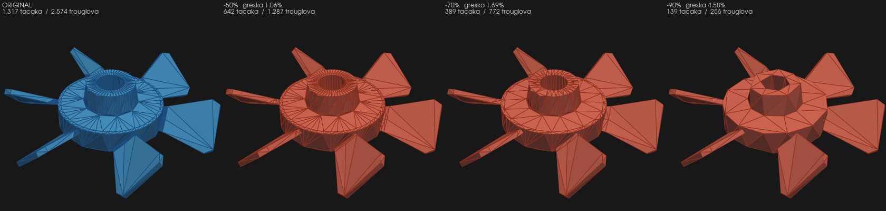
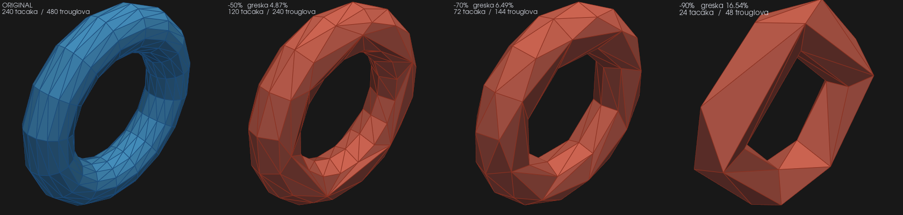
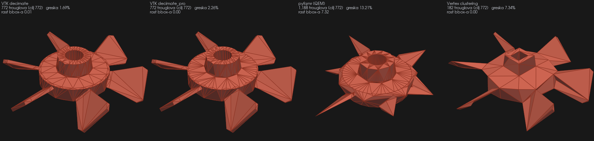
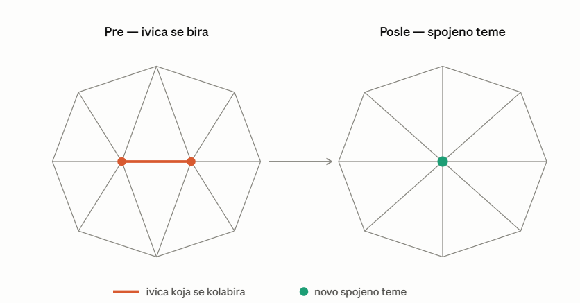
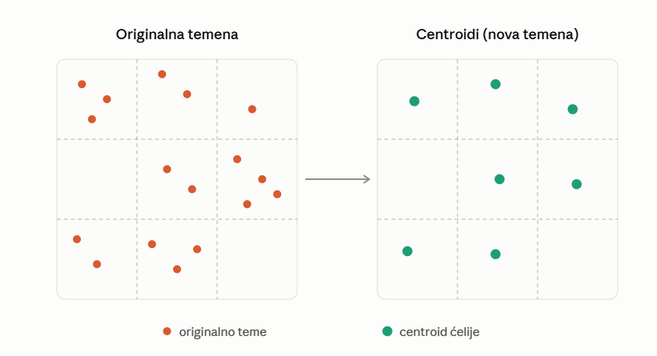
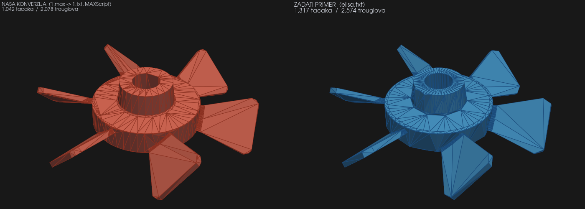
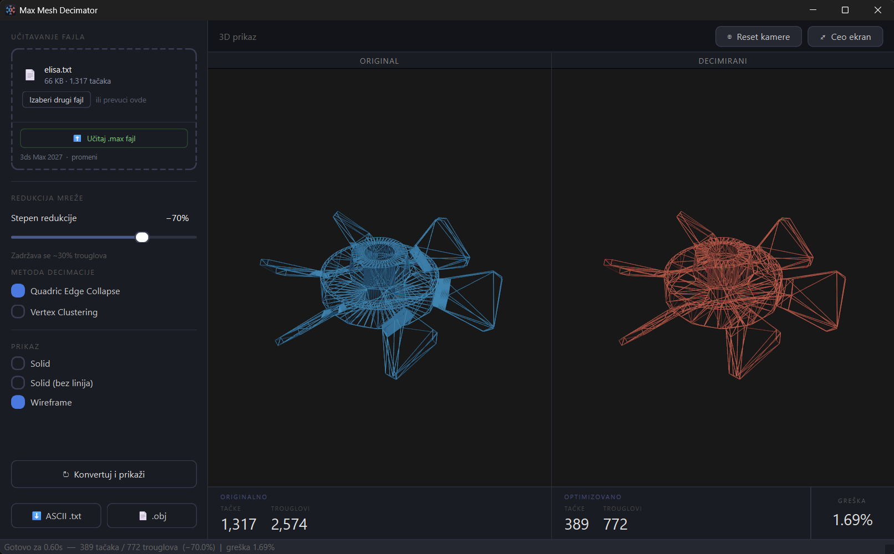
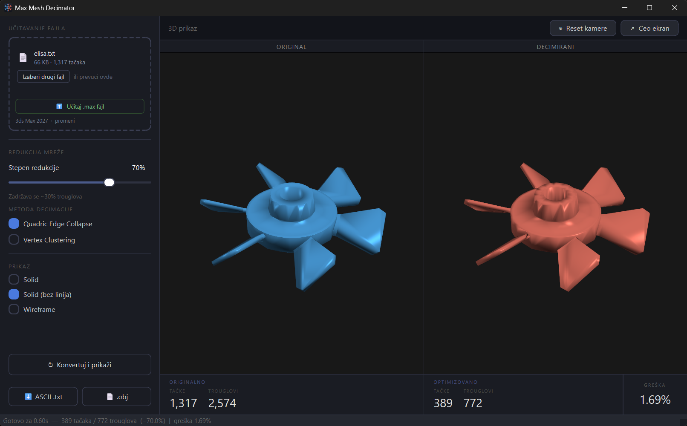
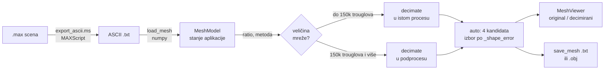

# Max Mesh Decimator

Desktop aplikacija koja konvertuje `.max` scene u ASCII zapis trougaone mreže, decimira mrežu
tako da konture modela ostanu sačuvane i prikazuje rezultat pored originala u 3D.

Python 3.12, PyQt6, PyVista/VTK. Testirano na 3ds Max 2027.


<sub><i>Primer: `elisa.txt` decimiran na 70% manje trouglova, 2.574 → 772 trougla, greška 1,69%.</i></sub>

## Zadatak

> Ideja je da se izvrši konverzija iz standardnih `.max` fajlova u ASCII oblik koji je
> priključen. Obično je tu više hiljada tačaka tako da je potrebno predvideti
> optimizaciju, smanjivanje broja tačaka ali da konture i osnovna struktura 3D modela
> ostanu sačuvani.

## ASCII format

```
1317                      ← broj tačaka
2574                      ← broj trouglova
15.7869  0.0000  39.7445  ← x y z, jedan red po tački (1317 redova)
...
0  1  2                   ← indeksi temena trougla, 0-based (2574 reda)
...
```

## Rezultati decimacije

### `elisa.txt`



| | tačke | trouglovi | greška | raspon modela |
|---|---:|---:|---:|---|
| original | 1.317 | 2.574 | / | `[247,3 · 234,6 · 63,5]` |
| -50% | 642 | 1.287 | 1,06% | nepromenjen |
| -70% | 389 | 772 | 1,69% | nepromenjen |
| -90% | 139 | 256 | 4,58% | nepromenjen |

### `TORUS.txt`



| | tačke | trouglovi | greška | Ojler `V−E+F` |
|---|---:|---:|---:|:-:|
| original | 240 | 480 | / | 0 |
| -50% | 120 | 240 | 4,87% | 0 |
| -70% | 72 | 144 | 6,49% | 0 |
| -90% | 24 | 48 | 16,54% | 0 |

### Kako se greška meri

Jednosmerna Hausdorffova distanca od originalnih tačaka do najbliže tačke rezultata,
normalizovana dijagonalom bounding box-a (`cKDTree`, po svim jezgrima):

$$\varepsilon = \frac{\max_{p \in V_{orig}} \min_{q \in V_{dec}} \lVert p - q \rVert}{\lVert bbox_{max} - bbox_{min} \rVert} \times 100\%$$

Uz nju se meri i rast bounding box-a, tj. koliko je rezultat izašao van originalne siluete. To
je osetljiviji test: ako bbox raste, temena su pomerena van modela, pa kontura nije očuvana.

## Metode decimacije

Ista mreža, isti cilj (772 trougla, -70%), četiri metode:



| metoda | rezultat | greška | rast bbox-a |
|---|---|---:|---:|
| VTK `decimate` (`vtk`) | 389 v / 772 f | 1,69% | 0,01 |
| VTK `decimate_pro` (`vtk_pro`) | 380 v / 772 f | 2,26% | 0,00 |
| pyfqmr (`pyfqmr`) | 588 v / 1.188 f | 13,21% | 7,32 |
| Vertex clustering (`cluster`) | 80 v / 182 f | 7,34% | 0,00 |

Nijedna metoda nije univerzalno najbolja: na elisi je VTK 7,8× precizniji od `pyfqmr`-a, a na
torusu je `pyfqmr` bolji (22,32 prema 27,01 u apsolutnim jedinicama). Zato režim `auto` pokreće
sve kandidate i bira po funkciji `_shape_error`, koja kombinuje geometrijsku grešku, rast
bbox-a i promašaj ciljnog broja trouglova.

Quadric Edge Collapse bira ivicu čije spajanje najmanje odstupa od originalne površine i spaja
joj temena u jedno, dok se ne dostigne ciljni broj trouglova.



Vertex Clustering deli prostor na voksele i sve tačke jedne ćelije zamenjuje njihovim
centroidom. Vrlo brzo i bez dodatnih zavisnosti, ali cilj se pogađa grubo.



## Konverzija `.max` → ASCII



Levo je rezultat konverzije zadatog `1.max`, desno zadati `elisa.txt`. Isti model, dva
nezavisna eksporta:

| | vrednost |
|---|---|
| naša konverzija `1.max` | 1.042 tačke / 2.078 trouglova |
| zadati `elisa.txt` | 1.317 tačaka / 2.574 trougla |
| tačaka sa tačnim parom u zadatom fajlu | 673 / 1.042 (64,6%) |
| najveće odstupanje od zadate mreže | 1,93% dijagonale |
| bounding box | `X ±123,64`, `Y ±117,28`, identičan |

## Aplikacija

1. Učitaj: prevuci `.txt` u zonu ili klikni za dijalog; za `.max` fajlove postoji dugme
   *Učitaj .max fajl*.
2. Podesi: slajder je jačina smanjenja (5-95%), radio dugmad su metoda.
3. Pokreni: *Konvertuj i prikaži*.
4. Pregledaj: original levo, decimirani desno.
5. Sačuvaj: ASCII `.txt` (isti format kao ulaz) ili `.obj`.

<table>
  <tr>
    <td width="50%"></td>
    <td width="50%"></td>
  </tr>
  <tr>
    <td align="center"><sub><b>Wireframe</b>, vidi se gde su trouglovi uklonjeni</sub></td>
    <td align="center"><sub><b>Solid bez linija</b>, silueta bez šuma ivica</sub></td>
  </tr>
</table>

## Arhitektura



```
├── main.py                   ← entry point (+ dispatch podprocesa u .exe-u)
├── core/
│   ├── converter.py          ← ASCII load/save + pokretanje 3ds Max-a
│   ├── decimator.py          ← 4 metode + _shape_error ocenjivanje
│   ├── decimate_proc.py      ← velike mreže u odvojenom procesu
│   ├── mesh_model.py         ← centralno stanje, statistike, greška
│   ├── max_finder.py         ← pronalaženje 3dsmax.exe
│   ├── paths.py              ← resursi i %APPDATA%, isto iz koda i iz .exe-a
│   ├── selftest.py           ← --selftest: provera uvoza i renderovanja
│   └── export_ascii.ms       ← MAXScript: .max → ASCII
├── ui/
│   ├── main_window.py        ← glavni prozor, workeri, drag&drop
│   ├── viewer_widget.py      ← dva PyVista panela (before/after)
│   └── styles.qss            ← tamna tema
├── docs/make_figures.py      ← generiše slike iz ovog README-a
├── generate_examples.py      ← test ASCII fajlovi
├── konvertor.spec            ← PyInstaller recept
├── package_release.py        ← sklapa ZIP za isporuku
└── TORUS.txt                 ← primer iz zadatka
```
## Performanse

Windows 11, Python 3.12, ratio 0.5, metoda `auto`:

| fajl | tačke | trouglovi | učitavanje | decimacija | greška |
|---|---:|---:|---:|---:|---:|
| `TORUS.txt` | 240 | 480 | 0,00 s | 0,01 s | 4,87% |
| `elisa.txt` | 1.317 | 2.574 | 0,00 s | 0,10 s | 1,06% |
| `BUNNY.txt` | 34.834 | 69.451 | 0,08 s | 0,80 s | 0,95% |
| `ARMADILLO.txt` | 172.974 | 345.944 | 0,34 s | 7,07 s | 0,39% |
| `DRAGON.txt` | 435.545 | 871.306 | 0,94 s | 13,45 s | 0,54% |

## Instalacija i pokretanje

```bash
pip install -r requirements.txt
python main.py
```

3ds Max je potreban samo za `.max` fajlove; ASCII fajlovi ne zahtevaju ništa osim Pythona.

```bash
pyinstaller konvertor.spec
python package_release.py
```

<sub>Master studije, Napredne tehnike u 3D modeliranju i animaciji · Elektronski fakultet u Nišu</sub>
