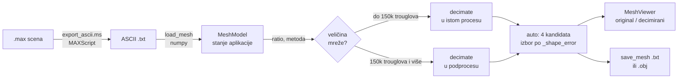

# 3ds Max → ASCII konvertor

Desktop aplikacija koja konvertuje `.max` scene u ASCII zapis trougaone mreže, decimira mrežu
tako da konture modela ostanu sačuvane i prikazuje rezultat pored originala u 3D.

Python 3.12, PyQt6, PyVista/VTK. Testirano na 3ds Max 2027.


<sub><i>Primer: `elisa.txt` decimiran na 70% manje trouglova, 2.574 → 772 trougla, greška 1,69%.</i></sub>

## Zadatak

> Ideja je da se izvrši konverzija iz standardnih `.max` fajlova u ASCII oblik koji je
> priključen. Obično je tu više hiljada tačaka tako da je potrebno predvideti
> optimizaciju, smanjivanje broja tačaka ali da konture i osnovna struktura 3D modela
> ostanu sačuvani.

| # | Zahtev | Status |
|:-:|--------|--------|
| 1 | Konverzija `.max` → ASCII | Urađeno. MAXScript export, proveren na 3ds Max 2027 sa zadatim `1.max` |
| 2 | Smanjenje broja tačaka uz očuvanje kontura | Urađeno. Četiri metode, izbor merenjem geometrijske greške |
| 3 | Rad sa oba data primera | Urađeno. `TORUS.txt` i `elisa.txt` prolaze ceo tok |
| 4 | 3D prikaz | Urađeno. Original i decimirani, tri režima prikaza |

Težina je u zahtevu 2: nije dovoljno smanjiti broj trouglova, treba to uraditi tako da silueta
ostane ista. Zato aplikacija svaku decimaciju i izmeri, a greška se prikazuje korisniku.

## ASCII format

```
1317                      ← broj tačaka
2574                      ← broj trouglova
15.7869  0.0000  39.7445  ← x y z, jedan red po tački (1317 redova)
...
0  1  2                   ← indeksi temena trougla, 0-based (2574 reda)
...
```

Nema zaglavlja ni komentara, lista trouglova počinje tačno na liniji `2 + nv`. Tri detalja koja
parser mora da poštuje, a koja se iz same specifikacije ne vide:

- Separator nije konzistentan. `TORUS.txt` koristi razmak, `elisa.txt` tab, pa se deli po bilo
  kom belom znaku.
- Nisu sve deklarisane tačke upotrebljene. `elisa.txt` deklariše 1.317 tačaka, a u trouglovima
  koristi 1.281; 36 tačaka nije vezano ni za jedan trougao.
- Model nije jedan zatvoren manifold. `elisa.txt` ima četiri odvojene komponente (575, 236, 235
  i 235 tačaka). To je ulazno ograničenje s kojim se radi, ne greška.

Učitavanje i upis idu preko `numpy.loadtxt` / `savetxt`, bez Python petlji. `DRAGON.txt` od
33 MB (435.545 tačaka) učita se za 0,94 s.

## Rezultati decimacije

### `elisa.txt`


| | tačke | trouglovi | greška | raspon modela |
|---|---:|---:|---:|---|
| original | 1.317 | 2.574 | / | `[247,3 · 234,6 · 63,5]` |
| -50% | 642 | 1.287 | 1,06% | nepromenjen |
| -70% | 389 | 772 | 1,69% | nepromenjen |
| -90% | 139 | 256 | 4,58% | nepromenjen |

Lopatice, glavčina i centralni otvor prepoznatljivi su i na -90%, gde je ostalo svega 10%
originalnih trouglova.

### `TORUS.txt`


| | tačke | trouglovi | greška | Ojler `V−E+F` |
|---|---:|---:|---:|:-:|
| original | 240 | 480 | / | 0 |
| -50% | 120 | 240 | 4,87% | 0 |
| -70% | 72 | 144 | 6,49% | 0 |
| -90% | 24 | 48 | 16,54% | 0 |

Torus je zatvoren torus (`V − E + F = 0`, genus 1), pa služi i kao provera topologije:
karakteristika ostaje `0`, dakle rupa u sredini nije „zatvorena" ni na najagresivnijem nivou.
Greška je veća nego kod elise jer je površina glatko zakrivljena, bez ravnih delova.

### Kako se greška meri

Jednosmerna Hausdorffova distanca od originalnih tačaka do najbliže tačke rezultata,
normalizovana dijagonalom bounding box-a (`cKDTree`, po svim jezgrima):

$$\varepsilon = \frac{\max_{p \in V_{orig}} \min_{q \in V_{dec}} \lVert p - q \rVert}{\lVert bbox_{max} - bbox_{min} \rVert} \times 100\%$$

Uz nju se meri i rast bounding box-a, tj. koliko je rezultat izašao van originalne siluete. To
je osetljiviji test: ako bbox raste, temena su pomerena van modela, pa kontura nije očuvana.

## Metode decimacije

Ista mreža, isti cilj (772 trougla, -70%), četiri metode:


| metoda | rezultat | greška | rast bbox-a |
|---|---|---:|---:|
| VTK `decimate` (`vtk`) | 389 v / 772 f | 1,69% | 0,01 |
| VTK `decimate_pro` (`vtk_pro`) | 380 v / 772 f | 2,26% | 0,00 |
| pyfqmr (`pyfqmr`) | 588 v / 1.188 f | 13,21% | 7,32 |
| Vertex clustering (`cluster`) | 80 v / 182 f | 7,34% | 0,00 |

`decimate_pro` samo uklanja postojeća temena i nikad ih ne pomera, pa nijedna nova tačka ne
može da izađe van siluete, otud rast bbox-a 0,00. `pyfqmr` ne dostiže cilj i vidno deformiše
lopatice, a clustering glavčinu svodi na blok.

Nijedna metoda nije univerzalno najbolja: na elisi je VTK 7,8× precizniji od `pyfqmr`-a, a na
torusu je `pyfqmr` bolji (22,32 prema 27,01 u apsolutnim jedinicama). Zato režim `auto` pokreće
sve kandidate i bira po funkciji `_shape_error`, koja kombinuje geometrijsku grešku, rast
bbox-a i promašaj ciljnog broja trouglova. Na mrežama iz zadatka to košta oko 110 ms.

Quadric Edge Collapse bira ivicu čije spajanje najmanje odstupa od originalne površine i spaja
joj temena u jedno, dok se ne dostigne ciljni broj trouglova.


Vertex Clustering deli prostor na voksele i sve tačke jedne ćelije zamenjuje njihovim
centroidom. Vrlo brzo i bez dodatnih zavisnosti, ali cilj se pogađa grubo.


## Konverzija `.max` → ASCII


Levo je rezultat konverzije zadatog `1.max`, desno zadati `elisa.txt`. Isti model, dva
nezavisna eksporta:

| | vrednost |
|---|---|
| naša konverzija `1.max` | 1.042 tačke / 2.078 trouglova |
| zadati `elisa.txt` | 1.317 tačaka / 2.574 trougla |
| tačaka sa tačnim parom u zadatom fajlu | 673 / 1.042 (64,6%) |
| najveće odstupanje od zadate mreže | 1,93% dijagonale |
| bounding box | `X ±123,64`, `Y ±117,28`, identičan |

Razlika u broju temena dolazi od toga kako Max spaja temena pri `snapshotAsMesh`; oblik je isti.

[`core/export_ascii.ms`](core/export_ascii.ms) radi u dva režima. Automatski čita `MAX_INPUT` /
`MAX_OUTPUT`, učita scenu, eksportuje i zatvori Max, bez dijaloga. Interaktivni (bez tih
promenljivih) eksportuje trenutnu scenu uz „Sačuvaj kao". Geometrija cele scene se spaja u
jednu listu uz pomeranje indeksa (`offset += m.numverts`), koordinate su svetske
(`snapshotAsMesh`), a indeksi se prevode iz 1-based u 0-based.

Max se pokreće vidljivo, ne headless. `3dsmaxbatch.exe` na edukacionoj licenci izlazi sa kodom
`-12` pre nego što uopšte pročita skriptu, dok interaktivni Max na istoj licenci radi normalno.
Ako je Max već pokrenut, konverzija se ne izvršava; aplikacija to prepozna i javi poruku.
Putanja do `3dsmax.exe` se traži kroz registry, `ADSK_3DSMAX_*` promenljive i `PATH`, a može se
i izabrati ručno (izbor se pamti).

## Aplikacija

1. Učitaj: prevuci `.txt` u zonu ili klikni za dijalog; za `.max` fajlove postoji dugme
   *Učitaj .max fajl*.
2. Podesi: slajder je jačina smanjenja (5-95%), radio dugmad su metoda.
3. Pokreni: *Konvertuj i prikaži*.
4. Pregledaj: original levo, decimirani desno.
5. Sačuvaj: ASCII `.txt` (isti format kao ulaz) ili `.obj`.

<table>
  <tr>
    <td width="50%"></td>
    <td width="50%"></td>
  </tr>
  <tr>
    <td align="center"><sub><b>Wireframe</b>, vidi se gde su trouglovi uklonjeni</sub></td>
    <td align="center"><sub><b>Solid bez linija</b>, silueta bez šuma ivica</sub></td>
  </tr>
</table>

## Arhitektura



```
├── main.py                   ← entry point (+ dispatch podprocesa u .exe-u)
├── core/
│   ├── converter.py          ← ASCII load/save + pokretanje 3ds Max-a
│   ├── decimator.py          ← 4 metode + _shape_error ocenjivanje
│   ├── decimate_proc.py      ← velike mreže u odvojenom procesu
│   ├── mesh_model.py         ← centralno stanje, statistike, greška
│   ├── max_finder.py         ← pronalaženje 3dsmax.exe
│   ├── paths.py              ← resursi i %APPDATA%, isto iz koda i iz .exe-a
│   ├── selftest.py           ← --selftest: provera uvoza i renderovanja
│   └── export_ascii.ms       ← MAXScript: .max → ASCII
├── ui/
│   ├── main_window.py        ← glavni prozor, workeri, drag&drop
│   ├── viewer_widget.py      ← dva PyVista panela (before/after)
│   └── styles.qss            ← tamna tema
├── docs/make_figures.py      ← generiše slike iz ovog README-a
├── generate_examples.py      ← test ASCII fajlovi
├── konvertor.spec            ← PyInstaller recept
├── package_release.py        ← sklapa ZIP za isporuku
└── TORUS.txt                 ← primer iz zadatka
```

Učitavanje, decimacija i konverzija iz Max-a rade u `QThread`-ovima da prozor ne zamrzne. To ne
rešava GIL: VTK i `pyfqmr` su native biblioteke koje ga ne otpuštaju, pa traka napretka staje po
nekoliko sekundi (na `DRAGON.txt` je dobijala 224 od 726 tick-ova, najduži prekid 4,5 s). Zato
mreže od 150.000 trouglova naviše idu u odvojen proces, preko `.npy` fajlova. Ispod tog praga
posao traje oko 2 s i podproces bi bio skuplji od njega.

## Performanse

Windows 11, Python 3.12, ratio 0.5, metoda `auto`:

| fajl | tačke | trouglovi | učitavanje | decimacija | greška |
|---|---:|---:|---:|---:|---:|
| `TORUS.txt` | 240 | 480 | 0,00 s | 0,01 s | 4,87% |
| `elisa.txt` | 1.317 | 2.574 | 0,00 s | 0,10 s | 1,06% |
| `BUNNY.txt` | 34.834 | 69.451 | 0,08 s | 0,80 s | 0,95% |
| `ARMADILLO.txt` | 172.974 | 345.944 | 0,34 s | 7,07 s | 0,39% |
| `DRAGON.txt` | 435.545 | 871.306 | 0,94 s | 13,45 s | 0,54% |

Mreže iz zadatka su reda hiljadu trouglova, tamo je ceo tok ispod desetinke sekunde. Stanford
modeli su uključeni kao provera da aplikacija ne stane na tri reda veličine većem ulazu.

## Instalacija i pokretanje

```bash
pip install -r requirements.txt
python main.py
```

3ds Max je potreban samo za `.max` fajlove; ASCII fajlovi ne zahtevaju ništa osim Pythona.

Pakovanje u samostalni `.exe` — recept je u `konvertor.spec`:

```bash
pyinstaller konvertor.spec
python package_release.py
```

Prvi korak pravi `dist/3DS Max ASCII Konvertor/`, drugi od toga sklapa ZIP sa primerima i
uputstvom. Namerno `--onedir`, ne `--onefile`: PyQt6 i VTK su nekoliko stotina megabajta, pa bi
onefile pri svakom pokretanju raspakivao sve u temp, a VTK-ovi native DLL-ovi u tom režimu često
ni ne prođu učitavanje.

Tri stvari koje u spakovanoj verziji rade drugačije nego iz izvornog koda, sve kroz `core/paths.py`:

| | izvorni kod | `.exe` |
|---|---|---|
| `styles.qss`, `export_ascii.ms` | koren projekta | `sys._MEIPASS` (privremen, briše se po izlasku) |
| `settings.json`, `crash.log` | `%APPDATA%\MeshConverter\` | isto — `_MEIPASS` ne bi preživeo gašenje |
| podproces za decimaciju | `python core/decimate_proc.py` | `<exe> --decimate-worker` |
| okruženje za 3ds Max | `os.environ` | `clean_env()` — bez Qt promenljivih |

Podproces je najosetljiviji: `sys.executable` u spakovanoj verziji je sama aplikacija, pa bi
stara komanda pokrenula drugu kopiju GUI-ja umesto radnika. Zato `main.py` zastavicu hvata pre
nego što napravi `QApplication`.

Provera spakovane verzije:

```bash
"dist/3DS Max ASCII Konvertor/3DS Max ASCII Konvertor.exe" --selftest
```

Prolazi kroz uvoze redom od numpy-ja do `pyvistaqt`, pa renderuje sferu offscreen i broji koliko
piksela nije pozadina. Izveštaj ide u `%APPDATA%\MeshConverter\selftest.txt` jer GUI build nema
konzolu. Postoji zato što `viewer_widget` neuspeli uvoz PyVista-e hvata i prelazi na prazne
panele — aplikacija se normalno otvori, samo bez 3D prikaza, i iz samog builda se ne vidi zašto.

Dve zamke pri pakovanju, obe otkrivene tek na spakovanoj verziji:

`pooch` liči na alat za preuzimanje primera koji se u `excludes` može izbaciti, ali ga
`import pyvista` povlači bezuslovno — bez njega ceo 3D prikaz tiho otkaže. `pandas` i `pyarrow`,
suprotno, nisu potrebni i njihovo izbacivanje skida ~60 MB.

PyInstaller-ov runtime hook za PyQt6 upisuje `QT_PLUGIN_PATH` i `QML2_IMPORT_PATH` u okruženje
procesa i gura `_internal` na početak `PATH`-a. Sve to nasleđuje svaki podproces — a 3ds Max je i
sam Qt aplikacija, pa je startovao sa **našim** Qt-om i padao uz „Startup Failure Detection".
Zato `converter.py` Max pokreće sa `clean_env()`, ne sa `os.environ`. Podproces decimacije je
izuzetak: to je ista ova aplikacija i te promenljive su joj potrebne.

Test ASCII mreže (sfera, cilindar, konus, Möbius, torus, plus Stanford modeli ako ima interneta)
i slike iz ovog README-a:

```bash
python generate_examples.py
python docs/make_figures.py
```

Slike nisu crtane na ruku. Svaka je render pravog rezultata iz `core/`, sa brojevima izmerenim u
tom istom pokretanju.

## Poznata ograničenja

- Torus na -90% (24 temena) ima grešku 16,54% i rast bbox-a 4,69. Na toliko maloj rezoluciji
  glatka zakrivljena površina se ne može verno predstaviti.
- Headless konverzija (`3dsmaxbatch.exe`) je neupotrebljiva na edukacionoj licenci. Kod za nju
  postoji, ali se koristi vidljivi Max.
- 36 nevezanih tačaka iz `elisa.txt` prenosi se u izlaz. Njihovo čišćenje pre decimacije ne
  menja rezultat, VTK i `pyfqmr` ih sami ignorišu.

---

<sub>Master studije, Napredne tehnike u 3D modeliranju i animaciji · Elektronski fakultet u Nišu</sub>
